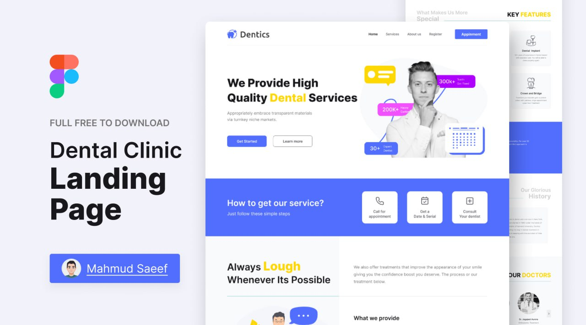

<!-- Improved compatibility of back to top link: See: https://github.com/othneildrew/Best-README-Template/pull/73 -->

<!-- PROJECT SHIELDS -->
[![Contributors][contributors-shield]][contributors-url]
[![Forks][forks-shield]][forks-url]
[![Stargazers][stars-shield]][stars-url]
[![Issues][issues-shield]][issues-url]

<!-- PROJECT LOGO -->
 

  

<h3 align="center">Dentics</h3>

  

    A landing page for a dental clinic.
     
    <a href="https://github.com/OleksandrZadvornyi/dental-clinic-landing-page"><strong>Explore the docs »</strong></a>
     
     
    <a href="https://github.com/OleksandrZadvornyi/dental-clinic-landing-page">View Demo</a>
    ·
    <a href="https://github.com/OleksandrZadvornyi/dental-clinic-landing-page/issues">Report Bug</a>
    ·
    <a href="https://github.com/OleksandrZadvornyi/dental-clinic-landing-page/issues">Request Feature</a>
  

  

    
  

<!-- ABOUT THE PROJECT -->
## About The Project

   
  
    

This is a landing page for a dental clinic "Dentics" built using the [template](https://www.figma.com/file/MTWUVMJIGoBjUZKJnfTU33/Landing-Page-for-Dental-Clinic-(Community)?type=design&node-id=0-1&mode=design&t=vSPIbxqZ6YM4ftVu-0) from [Figma](https://www.figma.com/). The topic of the website is dental services.

### Deployment

The website is deployed using [Netlify](https://www.netlify.com/). You can see it [here](https://denticss.netlify.app/).

(<a href="#readme-top">back to top</a>)

### Built With

This project does not use any libraries or frameworks. Only pure HTML, CSS  and JavaScript are used.

* [![HTML][HTML]][HTML-url]
* [![CSS][CSS]][CSS-url]
* [![JS][JS]][JS-url]

(<a href="#readme-top">back to top</a>)

<!-- CONTACT -->
## Contact

Oleksandr - [@telegram](https://t.me/oleksandr_zadvornyi) - zadvornyi.alex16@gmail.com

Project Link: [https://github.com/OleksandrZadvornyi/dental-clinic-landing-page](https://github.com/OleksandrZadvornyi/dental-clinic-landing-page)

(<a href="#readme-top">back to top</a>)

<!-- MARKDOWN LINKS & IMAGES -->
<!-- https://www.markdownguide.org/basic-syntax/#reference-style-links -->
[contributors-shield]: https://img.shields.io/github/contributors/OleksandrZadvornyi/dental-clinic-landing-page.svg?style=for-the-badge
[contributors-url]: https://github.com/OleksandrZadvornyi/dental-clinic-landing-page/graphs/contributors
[forks-shield]: https://img.shields.io/github/forks/OleksandrZadvornyi/dental-clinic-landing-page.svg?style=for-the-badge
[forks-url]: https://github.com/OleksandrZadvornyi/dental-clinic-landing-page/network/members
[stars-shield]: https://img.shields.io/github/stars/OleksandrZadvornyi/dental-clinic-landing-page.svg?style=for-the-badge
[stars-url]: https://github.com/OleksandrZadvornyi/dental-clinic-landing-page/stargazers
[issues-shield]: https://img.shields.io/github/issues/OleksandrZadvornyi/dental-clinic-landing-page.svg?style=for-the-badge
[issues-url]: https://github.com/OleksandrZadvornyi/dental-clinic-landing-page/issues
[license-shield]: https://img.shields.io/github/license/othneildrew/Best-README-Template.svg?style=for-the-badge
[license-url]: https://github.com/othneildrew/Best-README-Template/blob/master/LICENSE.txt
[product-screenshot]: website-preview.jpg
[HTML]: https://img.shields.io/badge/HTML-red?style=for-the-badge&logo=html5&logoColor=white
[HTML-url]: https://developer.mozilla.org/en-US/docs/Web/HTML
[CSS]: https://img.shields.io/badge/CSS-blue?&style=for-the-badge&logo=css3&logoColor=white
[CSS-url]: https://developer.mozilla.org/en-US/docs/Web/CSS
[JS]: https://img.shields.io/badge/JavaScript-yellow?style=for-the-badge&logo=javascript&logoColor=white
[JS-url]: https://developer.mozilla.org/en-US/docs/Web/JavaScript
