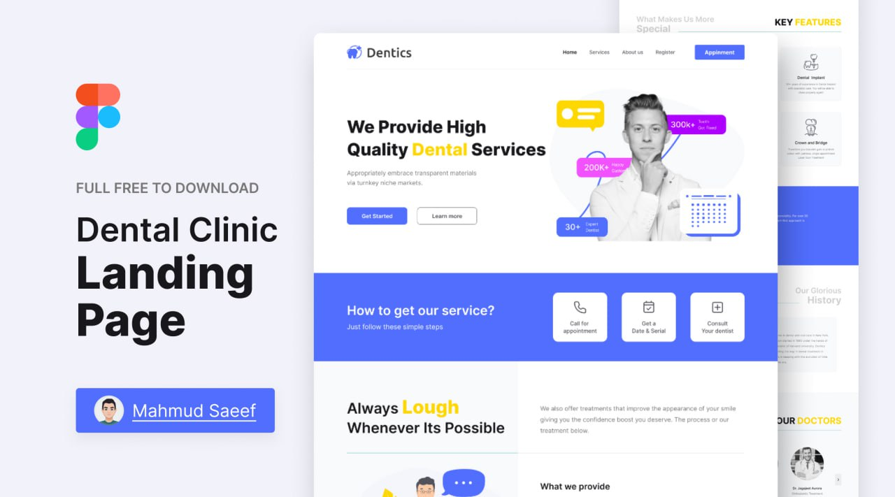

<!-- PROJECT SHIELDS -->
<p align="center">
  <a href="https://github.com/OleksandrZadvornyi/dental-clinic-landing/graphs/contributors"></a>
  <a href="https://github.com/OleksandrZadvornyi/dental-clinic-landing/network/members"></a>
  <a href="https://github.com/OleksandrZadvornyi/dental-clinic-landing/stargazers"></a>
  <a href="https://github.com/OleksandrZadvornyi/dental-clinic-landing/issues"></a>
  <a href="https://github.com/OleksandrZadvornyi/dental-clinic-landing/blob/master/LICENSE"></a>
</p>

<!-- PROJECT LOGO -->
<br />
<div align="center">
  <a href="https://github.com/OleksandrZadvornyi/dental-clinic-landing">
    
  </a>

  <h3 align="center">Dentics</h3>

  <p align="center">
    A landing page for a dental clinic.
    <br />
    <a href="https://github.com/OleksandrZadvornyi/dental-clinic-landing"><strong>Explore the docs »</strong></a>
    <br />
    <br />
    <a href="https://github.com/OleksandrZadvornyi/dental-clinic-landing">View Demo</a>
    ·
    <a href="https://github.com/OleksandrZadvornyi/dental-clinic-landing/issues/new?labels=bug&template=bug-report---.md">Report Bug</a>
    ·
    <a href="https://github.com/OleksandrZadvornyi/dental-clinic-landing/issues/new?labels=enhancement&template=feature-request---.md">Request Feature</a>
  </p>

  <p align="center">
    <a href="https://app.netlify.com/sites/denticss/deploys"></a>
  </p>
</div>


<!-- ABOUT THE PROJECT -->
## About The Project

<div align="center">
  <br/>
  <a href="https://denticss.netlify.app/"></a>
  <br/><br/>
</div>

This project was created for educational purposes to practice front-end development, responsive design, and localization. The project replicates a professional dental clinic website, incorporating best practices for modern web development. The landing page is built using this [template](https://www.figma.com/file/MTWUVMJIGoBjUZKJnfTU33/Landing-Page-for-Dental-Clinic-(Community)?type=design&node-id=0-1&mode=design&t=vSPIbxqZ6YM4ftVu-0) from [Figma](https://www.figma.com/).
<br><br>


### Deployment

The website is deployed using [Netlify](https://www.netlify.com/). You can see it [here](https://denticss.netlify.app/).
<br><br>


### Built With

This project is built with the following tools and technologies:

* [![HTML][HTML]][HTML-url]
* [![CSS][CSS]][CSS-url]
* [![JS][JS]][JS-url]
* [![WEBPACK][WEBPACK]][WEBPACK-url]
* [![I18NEXT][I18NEXT]][I18NEXT-url]
* [![PRETTIER][PRETTIER]][PRETTIER-url]

<br>


<!-- GETTING STARTED -->
## Getting Started


### Prerequisites

Before starting, make sure you have the following installed:

- **Node.js** (Recommended: Latest LTS version)
- **npm** (Installed with Node.js)
<br><br>


### Cloning the Repository

To get a local copy of this project, run the following command:

```bash
git clone https://github.com/OleksandrZadvornyi/dental-clinic-landing.git
```
<br>


### Installing Dependencies

Navigate into the project directory and install the required npm packages:

```bash
cd dental-clinic-landing
npm install
```
<br>


### Code Formatting

This project uses Prettier for consistent code formatting. To format the code:

```bash
npm run format
```
<br>


### Building the Project

To create a production-ready build of the project, run:

```bash
npm run build
```
<br>


### Viewing the Project Locally

Start a development server to view the project locally:

```bash
npm run start
```

After running the command, the website will open in your default browser.
<br><br>


<!-- ROADMAP -->
## Roadmap

- [x] Create a landing page with HTML and CSS
- [x] Improve mobile responsiveness for smaller screens
- [x] Integrate webpack into the project
- [x] Add animations to buttons and sections for a smoother user experience
- [x] Multi-language Support
    - [x] Ukrainian
    - [x] German
    - [x] French
    - [x] Spanish

See the [open issues](https://github.com/OleksandrZadvornyi/dental-clinic-landing/issues) for a full list of proposed features (and known issues).
<br><br>


<!-- CONTRIBUTING -->
## Contributing

If you have suggestions for improvements, feel free to fork the repository and create a pull request. Any contributions you make are **greatly appreciated**. You can also open an issue with the tag "enhancement".

1. Fork the Project
2. Create your Feature Branch (`git checkout -b feature/AmazingFeature`)
3. Commit your Changes (`git commit -m 'Add some AmazingFeature'`)
4. Push to the Branch (`git push origin feature/AmazingFeature`)
5. Open a Pull Request
<br><br>


<!-- LICENCE -->
## License

Distributed under the MIT License. See `LICENSE.txt` for more information.
<br><br>


<!-- CONTACT -->
## Contact

Oleksandr - [@telegram](https://t.me/oleksandr_zadvornyi) - zadvornyi.alex16@gmail.com

Project Link: [https://github.com/OleksandrZadvornyi/dental-clinic-landing](https://github.com/OleksandrZadvornyi/dental-clinic-landing)


<!-- MARKDOWN LINKS & IMAGES -->
<!-- https://www.markdownguide.org/basic-syntax/#reference-style-links -->
[HTML]: https://img.shields.io/badge/HTML-red?style=for-the-badge&logo=html5&logoColor=white
[HTML-url]: https://developer.mozilla.org/en-US/docs/Web/HTML
[CSS]: https://img.shields.io/badge/CSS-blue?&style=for-the-badge&logo=css3&logoColor=white
[CSS-url]: https://developer.mozilla.org/en-US/docs/Web/CSS
[JS]: https://img.shields.io/badge/JavaScript-yellow?style=for-the-badge&logo=javascript&logoColor=white
[JS-url]: https://developer.mozilla.org/en-US/docs/Web/JavaScript
[WEBPACK]: https://img.shields.io/badge/-Webpack-8DD6F9?style=for-the-badge&logo=webpack&logoColor=white
[WEBPACK-url]: https://webpack.js.org/
[I18NEXT]: https://img.shields.io/badge/i18next-009688?style=for-the-badge&logo=i18next&logoColor=white
[I18NEXT-url]: https://www.i18next.com/
[PRETTIER]: https://img.shields.io/badge/prettier-1A2C34?style=for-the-badge&logo=prettier&logoColor=F7BA3E
[PRETTIER-url]: https://prettier.io/
